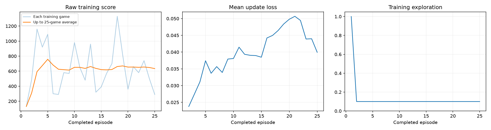
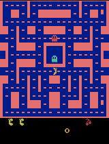
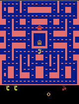

# train an agent to play Ms. Pac-Man

[](https://colab.research.google.com/github/pepealonso95/pacman-dqn/blob/main/pacman_dqn.ipynb)

**[Open the notebook in Google Colab](https://colab.research.google.com/github/pepealonso95/pacman-dqn/blob/main/pacman_dqn.ipynb)**

Open **[pacman_dqn.ipynb](pacman_dqn.ipynb)**, choose three numbers, and run all cells.
The complete DQN is in the notebook, split into short code cells with plain-language explanations.
No coding is needed. Keep `pacman_player.py` beside the notebook for the local floating gameplay player.

| Your choice | What it controls | Starting point |
|---|---|---|
| Exploration | Fraction of random training moves after warm-up | `0.20` |
| Episodes | Number of training games | `100` |
| Learning rate | Size of each learning update | `0.0001` |

Try five episodes to check your setup. Useful Atari learning may require much longer runs.
Exploration stays constant after 1,000 random warm-up decisions. The code includes an instruction for Claude Code or Codex to ask the student for these three choices before training.

---

## Class 3 submission (Luiza Teixeira)

This fork contains one executed training run of `pacman_dqn.ipynb`, submitted for Class 3
("Train a Ms. Pac-Man Agent"). The executed notebook (with all outputs visible) is
[`pacman_dqn.ipynb`](pacman_dqn.ipynb); selected evidence copied out of the run folder lives in
[`results/`](results/).

### My three hyperparameters

| Setting | Value | Why |
|---|---|---|
| Exploration | `0.10` | Lower than the `0.20` default so the trained agent leans more on what it has learned once warm-up ends, giving less noisy, more evaluation-like play during training itself. |
| Episodes | `25` | Enough to clear the assignment's 25-episode threshold (periodic GIF + checkpoint at episode 25) while staying realistic for a laptop with no CUDA GPU (Apple Silicon MPS only) — a 100-episode run would take roughly 4x longer for a class exercise. |
| Learning rate | `0.0001` | Kept at the notebook's suggested reference point. It's a standard, stable Adam step size for this network size; no reason to move it for a first run. |

All other settings (seeds, replay capacity, warm-up steps, target-sync interval, gamma, evaluation
seeds/exploration/step cap) were left at the notebook's fixed classroom values.

### What I expected vs. what happened

**Expected:** with only 25 episodes (15,032 total decisions, 3,509 learning updates) on a small
5,000-transition replay buffer, I expected marginal or inconsistent improvement — 25 episodes is a
fraction of what real Atari DQN training normally uses, and training loss often doesn't fall cleanly
in this short a window.

**Observed:** the trained agent's mean evaluation score rose from **492.0 → 772.0** (+280, all 5 seeds
identical before/after) — every one of the five evaluation games scored the same or higher after
training (see table below). Training-loss actually *increased* over the run (0.024 → ~0.05, see
`training_dashboard.png`), which is expected in DQN early on (the target network is chasing a moving,
still-inaccurate value estimate) — it's a reminder that loss is not the metric that matters here;
the evaluation scores are.

### Actual training budget

| Metric | Value |
|---|---|
| Completed episodes | 25 / 25 requested |
| Total decisions | 15,032 |
| Learning updates | 3,509 |
| Elapsed time (training, incl. periodic demo/checkpoint at ep. 25) | ~125 seconds |
| Elapsed time (full notebook: baseline eval + training + final eval + plotting + zip) | ~3.5 minutes |
| Hardware | Apple Silicon, MPS backend (no CUDA GPU) |
| Software | Python 3.13.15, PyTorch 2.14.0, Gymnasium 1.3.0, ALE 0.11.2, macOS 15.7.4 arm64 |

Run was **not** interrupted — it completed the full 25 requested episodes with real learning updates
(status: `"completed"` in [`results/training_summary.json`](results/training_summary.json)).

### Evidence

**Training dashboard** (raw score, mean update loss, exploration over the 25 episodes):



**Gameplay GIFs** (first ~20 seconds, 4x playback speed):

| Untrained (episode 0) | Intermediate (episode 25) | Best trained (final eval) |
|---|---|---|
|  |  |  |

Because training ran for exactly 25 episodes, the "intermediate" checkpoint/GIF (saved every 25
episodes) coincides with the final one — there was only one periodic checkpoint in this run.

**Before/after evaluation** — same 5 seeds, 5% exploration, 3,000-decision cap, both runs
(full data in [`results/comparison.json`](results/comparison.json)):

| Seed | Untrained score | Trained score |
|---|---|---|
| 101 | 350 | 380 |
| 202 | 500 | 610 |
| 303 | 320 | 810 |
| 404 | 800 | 810 |
| 505 | 490 | 1250 |
| **Mean** | **492.0** | **772.0** |

Other run files: [`results/config.json`](results/config.json) (full settings + hardware/package
versions), [`results/training.csv`](results/training.csv) (per-episode score/loss/exploration log),
[`results/training_summary.json`](results/training_summary.json) (episode/decision/update counts).

**Model checkpoints**: `untrained.pt`, `episode_0025.pt`, and `trained.pt` (~6.4 MB each) are kept
in the full run ZIP on my local machine (`pacman_runs/20260908_173251_006555.zip`, ~18 MB) rather
than committed to this repo — `.pt` files and `pacman_runs/` are gitignored by design, per the
project's own instructions to keep large checkpoints local or in a release.

### Observations, actions, rewards, and a limitation

- **Observations**: what the agent "sees" is not the raw game image but a stack of the last 4
  grayscale, 84×84 game screens (downscaled from the 210×160 color Atari frame). Stacking 4 frames
  lets the network infer motion (e.g. which way a ghost is moving) from otherwise-static images.
- **Actions**: the agent picks one of 9 joystick moves each decision (no-op, 4 directions, 4
  diagonals). One decision covers 4 emulator frames (frame-skipping), so a single choice controls
  about 1/15th of a second of real game time.
- **Rewards**: the reward is the raw in-game score delta from eating pellets, fruit, and ghosts
  (clipped to [-1, 1] only for the training loss target, never for the reported scores above). There
  is no extra shaping — the network has to learn "avoid ghosts, eat pellets" purely from the points
  Ms. Pac-Man's own scoring already gives it.
- **One limitation**: 25 episodes and a 5,000-transition replay buffer are tiny next to a real DQN
  (the original Nature paper used millions of frames and a 1M-transition buffer). The scores here are
  encouraging but noisy — game-to-game raw scores swing from ~300 to ~1,300 (see the dashboard's left
  panel) with no clear plateau, so this run demonstrates that learning is happening, not that the
  policy is stable or close to converged.
- **One next experiment**: I would extend `EPISODES` to 100 (the notebook's own default) with the
  same exploration and learning rate, since the training-loss curve here was still rising at episode
  25 rather than flattening — a longer run is the most direct way to see whether the improvement
  trend in the score continues or plateaus, before touching any other hyperparameter.

## Open and run

**Google Colab:** use the Colab button above, select Runtime → Change runtime type → T4 GPU if available, edit the three values in section 1, and choose Runtime → Run all. The setup cell installs packages automatically.

**Local Jupyter or VS Code:** clone or download this repository, open the notebook, select a Python 3.11–3.13 kernel, edit the three choices, and choose Run All. CUDA, Apple Silicon MPS, and CPU are detected automatically; a real training batch checks the selected device before the experiment starts.

**VS Code with `py313`:** select **Select Kernel → Python Environments → py313 (Python 3.13)**.
Use the Python and Jupyter extensions. The local Conda `py313` environment supports Tk for popup playback.
The notebook still runs if Tk is unavailable, but samples appear inline only.

### Fast floating gameplay samples

The before-training sample, every-25-game progress samples, and final sample play at **4× speed**.
A 20-second excerpt takes about five seconds to watch. Each local sample opens automatically in a separate
**always-on-top window**, with Pause, Replay, and a “Keep above other windows” toggle. Press Escape or close
the window to dismiss it. Each sample plays twice and stops on its final frame. Replay starts two more plays.
A new sample replaces the previous popup, and training continues while it plays.

The popup plays a recorded evaluation excerpt once that evaluation finishes. Training and evaluation already
run as fast as the hardware allows, without real-time delays. Faster preview playback does not change the
agent's decisions, learning settings, or full-game scores. The saved GIFs also use accelerated playback.

Set `SHOW_POPUPS = False` in the preview settings for inline playback only. Colab, remote kernels without
a desktop, and Python installations without Tk use the inline GIF. The popup helper is optional, so the
notebook still runs by itself in Colab.

### Read the learning process one piece at a time

Section 3 separates screen preparation, the network, memory, move selection, and a learning update.
Section 4 separates evaluation, playback, checkpoints, logging, and plots. Section 5 separates experiment
setup, baseline evaluation, one training game, progress samples, saving, and the final experiment loop.
Each code cell contains at most 33 lines and has an explanation immediately before it.

If you need to install Jupyter first:

```sh
python -m venv .venv
# macOS / Linux:
source .venv/bin/activate
# Windows PowerShell: .venv\Scripts\Activate.ps1
python -m pip install -r requirements.txt
python -m jupyter lab pacman_dqn.ipynb
```

## What you get

Each experiment saves a separate folder under `pacman_runs/`:

- Settings, hardware, and actual package versions in `config.json`.
- Untrained gameplay and new GIFs every 25 episodes.
- A training dashboard with raw score, loss, and exploration.
- All five untrained and trained evaluation scores in `comparison.json`.
- Untrained, periodic, and final model checkpoints for playback.
- CSV training history, elapsed time, decision count, and number of learning updates.
- A ZIP download with all results.

Use Interrupt / Stop once to end training early and save progress, then run section 6 onward for evaluation and download. The saved model includes any updates from the interrupted episode; the episode log contains completed episodes only. Checkpoints support playback, not exact training resumption. To start again, rerun from section 5a or choose Run All; the training cell guards against accidentally reusing an old experiment.

In Colab, download the ZIP before the session ends. Commit the notebook, selected GIFs, plots, comparison, and your written reflection to your own repository. Generated run folders and checkpoints are ignored by default; copy the selected evidence into a `results/` folder to publish it. Keep large checkpoints locally or attach them to a release.

## How it works

The environment is `ALE/MsPacman-v5`. Four grayscale 84 × 84 frames feed a convolutional Q-network, which predicts action values. The agent uses experience replay, a target network, Adam, Huber loss, and a discounted reward target. Game over removes the future-value term; time limits do not.

Frame skipping happens only in `AtariPreprocessing` (four frames per decision); the base environment uses `frameskip=1`. Reset fills the stack with the new game's initial screen. Sticky-action probability is 0.25, no-op resets use up to 30 actions, and losing one life does not end the episode. Each game is capped at 3,000 decisions, about 200 seconds of game time.

Replay stores each current stack plus one new frame as `uint8`: about 168 MiB at 5,000 transitions, plus Python, network, and batch overhead. Training samples 32 transitions every four decisions after warm-up. The target network syncs every 1,000 decisions; gamma is 0.99. Training rewards are clipped to [-1, 1], while all reported game scores are raw.

Before/after evaluation uses the same five seeds, 5% exploration, and step cap. The baseline is an untrained network. Evaluation uses a separate environment and never updates replay or weights. The best GIF is selected by full-game score, but only its first 20 seconds are recorded. Inspect all five scores before claiming improvement. The small replay memory and fixed exploration simplify the classroom exercise; this is not a benchmark-scale DQN reproduction.

## Make your own submission repository

Fork this repository or create your own repository containing the notebook and selected results. The notebook works by itself; README and requirements support setup and explanation.

## Verification

Executed every revised notebook cell in order through the real `py313` Jupyter kernel on macOS Apple Silicon with MPS, Python 3.13.9, PyTorch 2.10.0, Gymnasium 1.3.0, ALE 0.11.2, OpenCV headless 4.14.0.94, NumPy 2.3.4, Matplotlib 3.10.6, and Pillow 11.3.0.

The verification copy used 20% exploration, **five episodes**, learning rate 0.0001, and samples every two games to exercise the periodic popup/checkpoint path: 3,306 decisions and 577 learning updates. All five before/after evaluation games completed. Checks verified changed and finite model weights, finite losses after warm-up, periodic checkpoints and samples at games 2 and 4, accelerated GIF frame counts and duration, the dashboard, and ZIP contents.

The native Tk player was also tested on the local desktop: window mapping, loaded gameplay image, exactly two plays, window dimensions, always-on-top state, Pause/Play, Replay, and unpin/repin. The no-Tk inline fallback was checked separately. The updated notebook was opened in VS Code with `py313`; the ordered execution test used Jupyter programmatically, not a VS Code Run All click.

To repeat the five-game verification without editing the classroom notebook:

```sh
python tests/verify_notebook.py --kernel py313
# For a kernel without a local desktop:
python tests/verify_notebook.py --kernel py313 --no-popups
```

Run that command with the same Python environment used by the notebook. Its executed test notebook and all artifacts are saved under `pacman_runs/`.

This verifies execution, not strong Pac-Man performance. A full 100-episode run of this revision, CUDA, Windows, and hosted Colab have not been tested here. The distributed notebook has no saved outputs and retains its 100-episode starting value and every-25-game sample interval.

## Sources

- [ALE installation](https://ale.farama.org/getting-started/)
- [Gymnasium Atari preprocessing](https://gymnasium.farama.org/api/wrappers/misc_wrappers/#gymnasium.wrappers.AtariPreprocessing)
- [Gymnasium frame stacking](https://gymnasium.farama.org/api/wrappers/observation_wrappers/#gymnasium.wrappers.FrameStackObservation)
- [DQN paper](https://storage.googleapis.com/deepmind-media/dqn/DQNNaturePaper.pdf)
